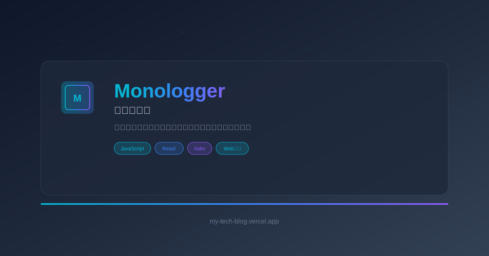

# Monologger - 技術ブログ

Modern tech blog built with Astro, featuring a sleek dark theme design and comprehensive SEO optimization.



## 🚀 Features

- **Modern Dark Design**: Refined dark-themed UI with cyan/blue gradients
- **SEO Optimized**: Complete SEO setup with structured data, OGP, and Twitter Cards
- **CMS Integration**: Seamless integration with microCMS for content management
- **Real-time Analytics**: Firebase integration for view tracking and comments
- **Responsive Design**: Mobile-first responsive design with Tailwind CSS
- **Performance**: Optimized images, lazy loading, and fast page transitions
- **Accessibility**: ARIA labels, keyboard navigation, and screen reader support

## 🛠️ Technology Stack

- **Framework**: [Astro](https://astro.build/) - Static Site Generator with SSR support
- **Styling**: [Tailwind CSS](https://tailwindcss.com/) - Utility-first CSS framework
- **CMS**: [microCMS](https://microcms.io/) - Headless CMS for content management
- **Database**: [Firebase Firestore](https://firebase.google.com/products/firestore) - Real-time database
- **Deployment**: [Vercel](https://vercel.com/) - Edge deployment platform
- **UI Components**: React components with Astro Islands architecture

## 📁 Project Structure

```
my-tech-blog/
├── public/                 # Static assets
│   ├── favicon.svg
│   ├── logo.svg
│   ├── default-og-image.svg
│   └── robots.txt
├── src/
│   ├── components/         # Reusable components
│   │   ├── ArticleCard.astro
│   │   ├── Header.astro
│   │   ├── Footer.astro
│   │   ├── Sidebar.astro
│   │   └── HeroSlideshowReact.tsx
│   ├── layouts/           # Page layouts
│   │   └── BaseLayout.astro
│   ├── lib/               # Utility libraries
│   │   ├── firebase.ts
│   │   └── microcms.ts
│   ├── pages/             # Route pages
│   │   ├── index.astro
│   │   ├── blog/
│   │   ├── category/
│   │   ├── search.astro
│   │   └── profile.astro
│   └── styles/            # Global styles
│       ├── global.css
│       └── main.scss
├── astro.config.mjs       # Astro configuration
├── tailwind.config.mjs    # Tailwind configuration
├── vercel.json           # Vercel deployment config
└── package.json
```

## 🔧 Setup & Installation

### Prerequisites

- Node.js 18.0.0 or higher
- npm or yarn package manager
- microCMS account
- Firebase project
- Vercel account (for deployment)

### Local Development

1. **Clone the repository**
   ```bash
   git clone https://github.com/your-username/my-tech-blog.git
   cd my-tech-blog
   ```

2. **Install dependencies**
   ```bash
   npm install
   ```

3. **Environment Variables Setup**
   
   Create a `.env` file in the root directory:
   ```bash
   # microCMS Configuration
   VITE_MICROCMS_SERVICE_DOMAIN=your-service-domain
   MICROCMS_API_KEY=your-api-key
   VITE_MICROCMS_API_URL=https://your-service-domain.microcms.io/api/v1
   
   # Firebase Configuration (Client-side)
   VITE_FIREBASE_API_KEY=your-api-key
   VITE_FIREBASE_AUTH_DOMAIN=your-project.firebaseapp.com
   VITE_FIREBASE_PROJECT_ID=your-project-id
   VITE_FIREBASE_STORAGE_BUCKET=your-project.appspot.com
   VITE_FIREBASE_MESSAGING_SENDER_ID=your-sender-id
   VITE_FIREBASE_APP_ID=your-app-id
   VITE_FIREBASE_MEASUREMENT_ID=your-measurement-id
   ```

4. **Start development server**
   ```bash
   npm run dev
   ```

   The site will be available at `http://localhost:4321`

## 📝 Content Management

### microCMS Schema Setup

Create the following content types in your microCMS dashboard:

#### Blog Content Type
```json
{
  "title": "Text Field",
  "description": "Text Field",
  "content": "Rich Editor",
  "eyecatch": "Image",
  "category": "Select Field (Multiple)"
}
```

#### Profile Content Type
```json
{
  "name": "Text Field",
  "description": "Text Area",
  "avatar": "Image",
  "xUrl": "Text Field",
  "githubUrl": "Text Field",
  "portfolio_intro": "Rich Editor",
  "skills": "Text Area",
  "work_history": "Rich Editor",
  "contact_email": "Text Field"
}
```

### Firebase Setup

1. Create a new Firebase project
2. Enable Firestore Database
3. Create a `views` collection for tracking article views
4. Set up Firebase Authentication (optional)
5. Configure security rules as needed

## 🚀 Deployment

### Vercel Deployment

1. **Connect to Vercel**
   ```bash
   npm install -g vercel
   vercel login
   vercel
   ```

2. **Environment Variables**
   
   Add all environment variables to your Vercel project settings:
   - Go to Project Settings → Environment Variables
   - Add all variables from your local `.env` file

3. **Automatic Deployments**
   
   Push to your main branch to trigger automatic deployments.

### Custom Domain Setup

1. Add your custom domain in Vercel project settings
2. Update `astro.config.mjs` with your production domain:
   ```javascript
   export default defineConfig({
     site: "https://your-domain.com",
     // ... other config
   });
   ```
3. Update `robots.txt` with your domain

## 🎨 Customization

### Theme Colors

The project uses a dark theme with customizable accent colors defined in `tailwind.config.mjs`:

```javascript
colors: {
  primary: {
    50: '#f0f9ff',
    500: '#06b6d4',  // Main accent color
    600: '#0891b2',
    // ... other shades
  }
}
```

### Logo and Branding

- Replace `/public/logo.svg` with your logo
- Update `/public/favicon.svg` with your favicon
- Modify the OGP image at `/public/default-og-image.svg`

## 📊 SEO Features

- **Structured Data**: JSON-LD schema for articles and website
- **Open Graph**: Complete OGP meta tags for social sharing
- **Twitter Cards**: Optimized Twitter card configuration
- **Sitemap**: Automatic sitemap generation
- **Robots.txt**: Search engine crawling instructions
- **Canonical URLs**: Proper canonical URL handling

## 🔧 Available Scripts

| Command | Description |
|---------|-------------|
| `npm run dev` | Start development server |
| `npm run build` | Build for production |
| `npm run preview` | Preview production build |
| `npm run astro -- --help` | Show Astro CLI help |

## 📄 License

This project is licensed under the MIT License - see the [LICENSE](LICENSE) file for details.

## 🤝 Contributing

Contributions are welcome! Please feel free to submit a Pull Request.

## 📞 Support

If you have any questions or need help with setup, please open an issue on GitHub.

---

Built with ❤️ using [Astro](https://astro.build/) and modern web technologies.
