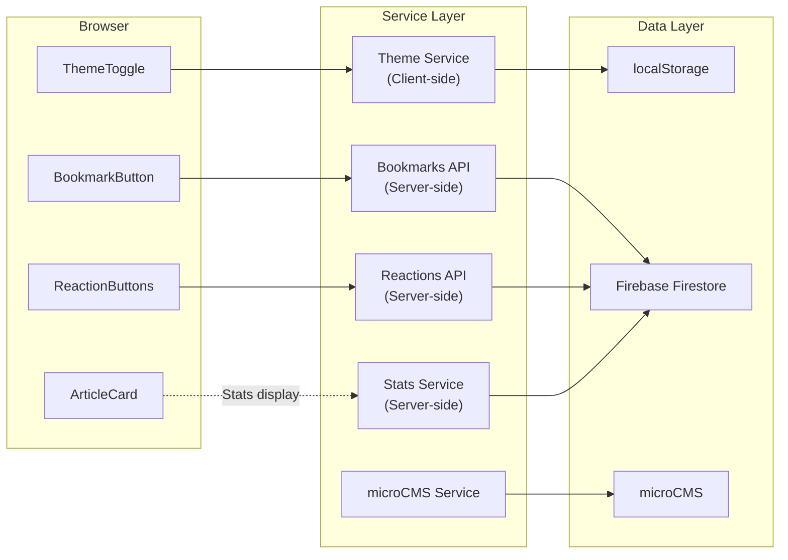
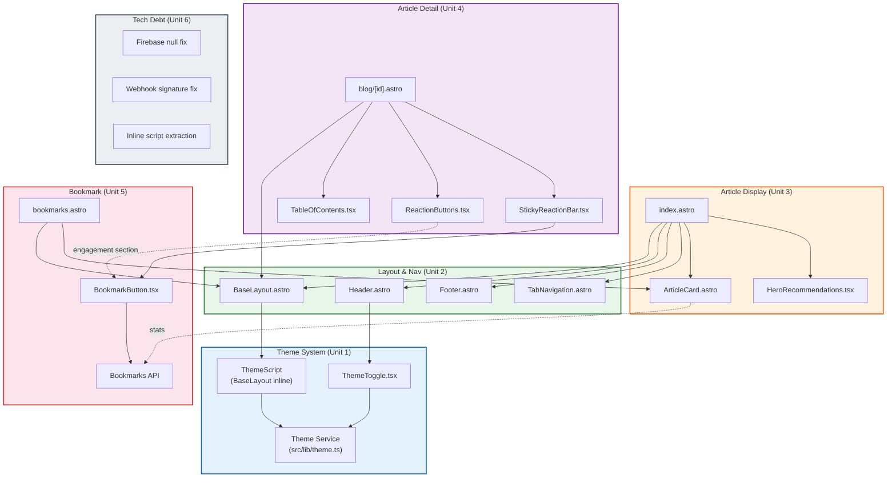

# Application Design - Consolidated Document

## Overview

Monologger ブログの Zenn.dev インスパイア UI/UX 全面改修に伴うアプリケーション設計。テーマシステムの新設、レイアウト刷新、ブックマーク機能の完成、技術的負債の解消を含む。

### Design Decisions Summary
| # | Decision | Choice |
|---|----------|--------|
| 1 | テーマ切替UIの配置 | ヘッダー右端（Zennと同様） |
| 2 | デフォルトテーマ | システム設定に従う（prefers-color-scheme） |
| 3 | 記事カード表示形式 | グリッド/リスト切替維持 + Zenn風簡素化 |
| 4 | ヒーロースライドショー | 簡素化（コンパクトな推薦カード群） |
| 5 | ブックマーク認証 | セッションID方式（localStorage UUID） |

---

## 1. Components

### New Components (5)

| Component | Type | File | Purpose |
|-----------|------|------|---------|
| ThemeToggle | React (.tsx) `client:load` | `src/components/ThemeToggle.tsx` | ライト/ダークテーマ切替UI |
| ThemeScript | Astro inline script | BaseLayout.astro `<head>` 内 | FOUC防止（DOM解析前テーマ適用） |
| TabNavigation | Astro (.astro) | `src/components/TabNavigation.astro` | ホームページのコンテンツフィルタリングタブ |
| BookmarkButton | React (.tsx) `client:load` | `src/components/BookmarkButton.tsx` | 記事ブックマーク追加/削除 |
| BookmarksPage | Astro (.astro) | `src/pages/bookmarks.astro` | ブックマーク一覧ページ（CSR） |

### Modified Components (11)

| Component | Modification Level | Key Changes |
|-----------|-------------------|-------------|
| BaseLayout.astro | Major | ThemeScript挿入、`dark:` バリアント、CSS変数 |
| Header.astro | Major | ThemeToggle追加、Zenn風ナビ簡素化 |
| Footer.astro | Moderate | Zenn風4セクション構成 |
| ArticleCard.astro | Major | Zenn風デザイン、メタ情報追加（reactions/views/bookmarks） |
| HeroSlideshowReact.tsx | Major | → HeroRecommendations.tsx に改名、コンパクト化 |
| Sidebar.astro | Moderate | テーマ対応、Zenn風簡素化 |
| ReactionButtons.tsx | Moderate | UI簡素化、BookmarkButton統合表示 |
| StickyReactionBar.tsx | Moderate | BookmarkButton追加、テーマ対応 |
| TableOfContents.tsx | Minor | テーマ対応スタイル |
| CategoryList.tsx | Minor | テーマ対応スタイル |
| All other .astro components | Minor | ハードコードカラー → `dark:` バリアント |

### Unchanged Components
- LinkCard.astro, KeyboardNavigation.astro, Comments.astro

---

## 2. Component Methods

### ThemeToggle.tsx
```typescript
getInitialTheme(): 'light' | 'dark'     // localStorage → system → fallback
toggleTheme(): void                      // classList.toggle + localStorage保存
useSystemThemeListener(): void           // system theme変更の自動追従
```

### ThemeScript (inline)
```typescript
// FOUC防止：DOM解析前に同期実行
(function() {
  const stored = localStorage.getItem('theme');
  const prefersDark = window.matchMedia('(prefers-color-scheme: dark)').matches;
  const theme = stored || (prefersDark ? 'dark' : 'light');
  document.documentElement.classList.toggle('dark', theme === 'dark');
})();
```

### TabNavigation.astro
```typescript
interface Props {
  activeTab: string;       // 'latest' | 'popular' | category名
  categories: string[];
}
// タブクリック → ?tab={value} クエリパラメータ更新
```

### BookmarkButton.tsx
```typescript
fetchBookmarkStatus(blogId, userId): Promise<boolean>
toggleBookmark(blogId, userId): Promise<{ success, action }>
animateBookmark(isBookmarked): void

interface BookmarkButtonProps {
  blogId: string;
  title?: string;
}
```

### Bookmarks API (src/pages/api/bookmarks/[blogId].ts)
```typescript
GET({ params, url }): Promise<Response>    // → { isBookmarked, bookmarkCount }
POST({ request, params }): Promise<Response> // → { success, action, bookmarkCount }
```

### ArticleCard.astro (Updated Props)
```typescript
interface Props {
  // 既存フィールド + 新規追加:
  reactionCount?: number;
  viewCount?: number;
  bookmarkCount?: number;
}
```

### HeroRecommendations.tsx (Renamed)
```typescript
interface HeroRecommendationsProps {
  posts: Blog[];  // 人気記事（最大3件）
}
```

---

## 3. Services

### Service Layer Summary

| Service | Type | Status | Purpose |
|---------|------|--------|---------|
| Theme Service | Client-side (src/lib/theme.ts) | New | テーマ状態管理・永続化 |
| Bookmark Service | Server-side API | New | ブックマークCRUD・統計管理 |
| Article Stats Service | Server-side | Enhanced | 統計情報集約（getBulkArticleStats追加） |
| microCMS Service | Server-side | Unchanged | CMS通信レイヤー |
| Firebase Service | Server-side | Minor Enhancement | nullチェック強化 |

### Service Interaction Diagram



### Orchestration Patterns

**Page Load (index.astro)**:
1. SSR: microCMS → getBlogs()
2. SSR: Firebase → getBulkArticleStats()
3. SSR: Firebase → getPopularPosts()
4. Render: HTML + ArticleCards (stats付き)
5. Client: React Islands hydration (ThemeToggle, BookmarkButton)

**Article View (blog/[id].astro)**:
1. SSR: microCMS → getBlogDetail()
2. SSR: Firebase → incrementViewCount() (nullチェック付き)
3. SSR: Cheerio → generateTOC()
4. Render: HTML + Article content
5. Client: React Islands hydration (TOC, Reactions, StickyBar, Bookmark)
6. Client: API calls for reactions/bookmark status

---

## 4. Component Dependencies

### Dependency Graph



### Critical Path
```
Unit 1 (Theme) → Unit 2 (Layout) → Unit 3/4/5 (parallel) → Build & Test
Unit 6 (Tech Debt) → Independent, parallel execution possible
```

### Data Flow Summary

| Data | Source | Consumer | Flow |
|------|--------|----------|------|
| Theme preference | localStorage | ThemeToggle, ThemeScript | Client-only |
| System theme | prefers-color-scheme | ThemeScript | Client-only |
| Article content | microCMS | Pages (SSR) | Server → Client |
| View counts | Firebase views | index.astro, blog/[id].astro | Server → Client |
| Reaction data | Firebase reactions | ReactionButtons, ArticleCard | API → Client |
| Bookmark data | Firebase bookmarks | BookmarkButton, bookmarks.astro | API → Client |
| Stats aggregate | Firebase blog_stats | ArticleCard (SSR) | Server → Client |
| Session ID | localStorage | BookmarkButton, ReactionButtons | Client → API |

---

## 5. Requirements Traceability

| Requirement | Component(s) | Status |
|-------------|-------------|--------|
| FR-1: レイアウト再設計（テーマ、タブ） | ThemeToggle, ThemeScript, TabNavigation, BaseLayout, Header, Footer | Covered |
| FR-2: 記事カード再設計 | ArticleCard (modified), HeroRecommendations | Covered |
| FR-3: 記事詳細改善 | blog/[id].astro, TOC, ReactionButtons, StickyReactionBar | Covered |
| FR-4: ブックマーク機能完成 | BookmarkButton, Bookmarks API, bookmarks.astro | Covered |
| FR-5: 検索強化 | TabNavigation (タブフィルタ) | Partially Covered (基本フィルタリング) |
| FR-6: ヒーロー再設計 | HeroRecommendations (renamed) | Covered |
| TR-1: 技術的負債解消 | Firebase null fix, Webhook signature fix, Inline script extraction | Covered (Unit 6) |
| TR-2: Tailwind darkMode | BaseLayout, All components | Covered |
| TR-3: テーマ管理 | Theme Service (theme.ts) | Covered |

---

## Detailed Artifact References
- Components: `aidlc-docs/inception/application-design/components.md`
- Methods: `aidlc-docs/inception/application-design/component-methods.md`
- Services: `aidlc-docs/inception/application-design/services.md`
- Dependencies: `aidlc-docs/inception/application-design/component-dependency.md`
