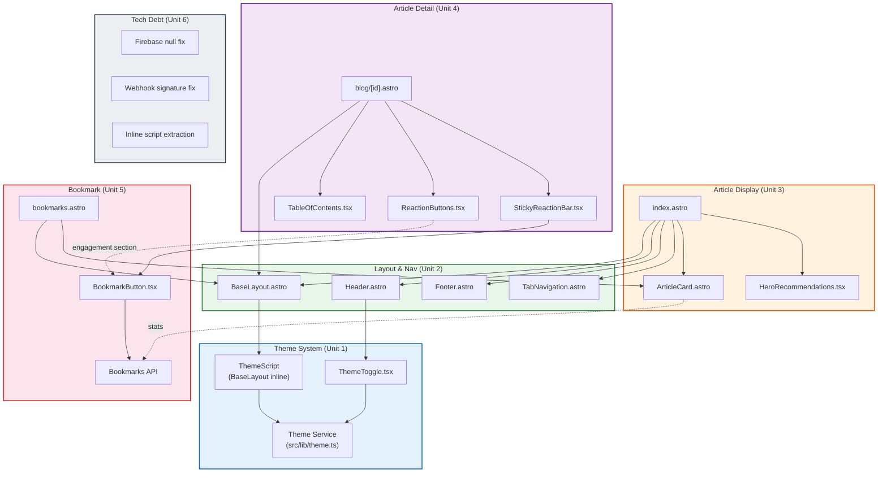

# Component Dependencies

## Dependency Matrix



## Unit Dependency Order

```
Unit 1 (Theme) ──┬──→ Unit 2 (Layout) ──┬──→ Unit 3 (Cards/Home)
                 │                       ├──→ Unit 4 (Article Detail)
                 │                       └──→ Unit 5 (Bookmark)
                 │
Unit 6 (Tech Debt) ──→ (Independent, parallel execution possible)
```

### Critical Path
```
Unit 1 → Unit 2 → Unit 3/4/5 (parallel) → Build & Test
```

---

## Detailed Dependencies by Component

### New → New Dependencies
| Source | Target | Type | Reason |
|--------|--------|------|--------|
| ThemeToggle.tsx | theme.ts | Import | テーマ切替ロジック |
| BookmarkButton.tsx | /api/bookmarks/[blogId] | HTTP | ブックマークAPI呼び出し |
| StickyReactionBar.tsx | BookmarkButton.tsx | Composition | ブックマークボタン統合 |
| bookmarks.astro | ArticleCard.astro | Composition | ブックマーク一覧のカード表示 |
| TabNavigation.astro | (none) | - | 自己完結型 |

### New → Existing Dependencies
| Source | Target | Type | Reason |
|--------|--------|------|--------|
| ThemeScript | localStorage | Runtime | テーマ永続化 |
| BookmarkButton.tsx | utils.ts (generateSessionId) | Import | ユーザーID取得 |
| Bookmarks API | firebase.ts | Import | Firestore操作 |
| Bookmarks API | firebase-collections.ts | Import | 型定義・定数 |
| bookmarks.astro | BaseLayout.astro | Composition | レイアウト継承 |

### Existing → New Dependencies (Modified)
| Source | Target | Type | Reason |
|--------|--------|------|--------|
| BaseLayout.astro | ThemeScript | Inline | FOUC防止 |
| Header.astro | ThemeToggle.tsx | Composition | テーマ切替UI |
| index.astro | TabNavigation.astro | Composition | タブナビ |
| blog/[id].astro | BookmarkButton.tsx | Composition | ブックマークUI |
| StickyReactionBar.tsx | BookmarkButton.tsx | Composition | サイドバー統合 |
| ArticleCard.astro | (stats data) | Props | メタ情報表示 |

---

## Communication Patterns

### 1. Theme System (Synchronous, Client-side)
```
ThemeToggle (click)
  → theme.ts: toggleTheme()
    → localStorage.setItem('theme', newTheme)
    → document.documentElement.classList.toggle('dark')
  → React setState (re-render icon)
```

### 2. Bookmark Flow (Async, Client-Server)
```
BookmarkButton (click)
  → fetch POST /api/bookmarks/{blogId}
    → Firestore: check existing bookmark
    → Firestore: add/remove bookmark (transaction)
    → Firestore: update blog_stats.bookmarkCount
  ← { success, action, bookmarkCount }
  → React setState (update icon + count)
```

### 3. Stats Display (SSR, Server-side)
```
index.astro (build/request)
  → Firebase: getBulkArticleStats(blogIds)
  ← Map<blogId, { viewCount, reactionCount, bookmarkCount }>
  → ArticleCard (props: reactionCount, viewCount, bookmarkCount)
```

### 4. Tab Navigation (Navigation, Client-side)
```
TabNavigation (click)
  → window.location = ?tab={selected}
  → SSR: page re-renders with filtered content
```

---

## Data Flow Summary

| Data | Source | Consumer | Flow |
|------|--------|----------|------|
| Theme preference | localStorage | ThemeToggle, ThemeScript | Client-only |
| System theme | prefers-color-scheme | ThemeScript | Client-only |
| Article content | microCMS | Pages (SSR) | Server → Client |
| View counts | Firebase views | index.astro, blog/[id].astro | Server → Client |
| Reaction data | Firebase reactions | ReactionButtons, ArticleCard | API → Client |
| Bookmark data | Firebase bookmarks | BookmarkButton, bookmarks.astro | API → Client |
| Stats aggregate | Firebase blog_stats | ArticleCard (SSR) | Server → Client |
| Session ID | localStorage | BookmarkButton, ReactionButtons | Client → API |
