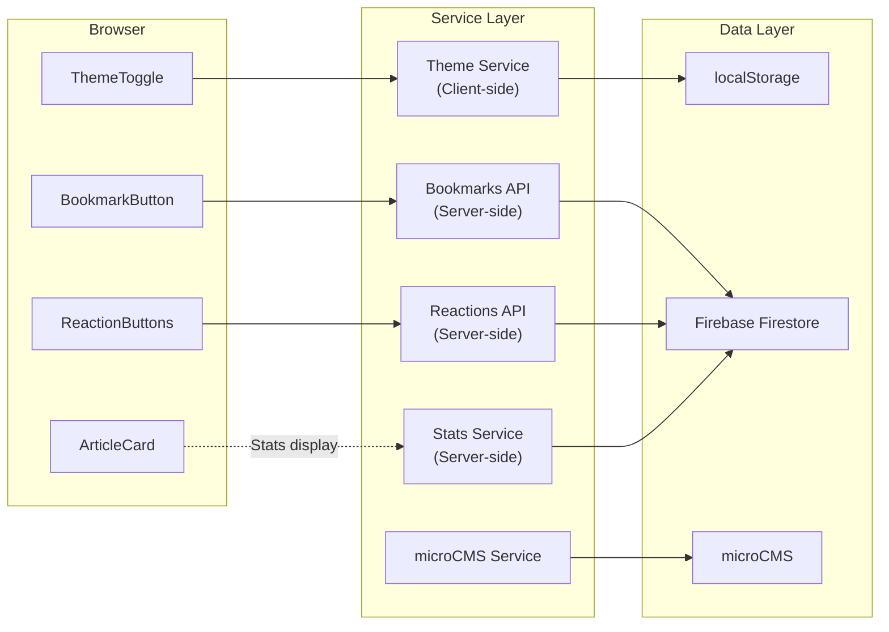

# Services Design

## Service Layer Overview

Monologger のサービスレイヤーは、主にサーバーサイド API Routes とクライアントサイド Lib モジュールの2層構成。今回の改修では既存のサービスパターンを踏襲しつつ、テーマ管理とブックマークサービスを追加します。

---

## 1. Theme Service (New - Client-side)

### Purpose
テーマ状態の管理と永続化を提供するクライアントサイドサービス。

### Responsibilities
- テーマ状態の読み取り（localStorage + prefers-color-scheme）
- テーマ状態の書き込み（localStorage）
- DOM への反映（html.classList）
- システムテーマ変更の監視

### Interface
```typescript
// src/lib/theme.ts

export type Theme = 'light' | 'dark';

// テーマ取得（localStorage → system → fallback）
export function getTheme(): Theme;

// テーマ設定（localStorage + DOM更新）
export function setTheme(theme: Theme): void;

// テーマトグル
export function toggleTheme(): Theme;

// システムテーマ変更の監視開始
export function watchSystemTheme(callback: (theme: Theme) => void): () => void;

// localStorage のテーマ設定をクリア（システム設定に戻す）
export function clearThemePreference(): void;
```

### Interactions
- **ThemeToggle.tsx** → `toggleTheme()`, `getTheme()`
- **BaseLayout.astro** → ThemeScript（インラインで同等ロジック実行）
- **All components** → Tailwind `dark:` クラスで自動対応

---

## 2. Bookmark Service (New - Server-side API)

### Purpose
ブックマーク機能のCRUD操作と統計管理。

### Responsibilities
- ブックマークの追加/削除/トグル
- ブックマーク状態の取得
- ユーザーのブックマーク一覧取得
- ブックマーク統計の更新（blog_stats コレクション連動）

### Interface
```typescript
// Server-side (API Route内で使用)

// ブックマーク追加
async function addBookmark(blogId: string, userId: string, metadata?: BookmarkMetadata): Promise<Result>;

// ブックマーク削除
async function removeBookmark(blogId: string, userId: string): Promise<Result>;

// ブックマークトグル
async function toggleBookmark(blogId: string, userId: string, metadata?: BookmarkMetadata): Promise<Result>;

// ブックマーク状態取得
async function getBookmarkStatus(blogId: string, userId: string): Promise<{ isBookmarked: boolean }>;

// ユーザーのブックマーク一覧取得
async function getUserBookmarks(userId: string): Promise<Bookmark[]>;

// ブックマーク統計更新（blog_stats連動）
async function updateBookmarkStats(blogId: string, countChange: number): Promise<void>;
```

### Data Pattern
- 既存の Reactions API パターンを踏襲
- Firestore Transaction によるアトミック統計更新
- 重複チェック（同一ユーザー + 同一記事）

---

## 3. Article Stats Service (Enhanced - Existing)

### Purpose
記事の統計情報を集約して提供。ArticleCard のメタ情報表示に使用。

### Enhancement
```typescript
// 既存: blog_stats コレクションから取得
// 新規: カード表示用の軽量データ取得

// 複数記事の統計を一括取得（ホームページ・一覧ページ用）
async function getBulkArticleStats(blogIds: string[]): Promise<Map<string, ArticleStats>>;

interface ArticleStats {
  viewCount: number;
  reactionCount: number;    // 全リアクションの合計
  bookmarkCount: number;
}
```

### Interactions
- **index.astro** → `getBulkArticleStats()` でカード表示用データ取得
- **blog/[id].astro** → 個別記事の統計取得（既存）
- **Reactions API** → 統計更新（既存）
- **Bookmarks API** → 統計更新（新規）

---

## 4. microCMS Service (Unchanged)

### Purpose
microCMS API との通信レイヤー。変更なし。

### Current Interface
- `getBlogs(queries?)` - 記事一覧
- `getBlogDetail(contentId, queries?)` - 記事詳細
- `getProfile(queries?)` - プロフィール
- `getProjects(queries?)` - プロジェクト

---

## 5. Firebase Service (Minor Enhancement)

### Purpose
Firebase Firestore との接続レイヤー。

### Enhancement
- null チェックの強化（index.astro での使用箇所）
- Bookmarks コレクションの操作追加

---

## Service Interaction Diagram



---

## Orchestration Patterns

### Page Load Orchestration (index.astro)
```
1. SSR: microCMS → getBlogs()
2. SSR: Firebase → getBulkArticleStats() (viewCount, reactionCount, bookmarkCount)
3. SSR: Firebase → getPopularPosts() (ヒーロー用)
4. Render: HTML + ArticleCards (stats付き)
5. Client: React Islands hydration (ThemeToggle, BookmarkButton)
```

### Article View Orchestration (blog/[id].astro)
```
1. SSR: microCMS → getBlogDetail()
2. SSR: Firebase → incrementViewCount() (nullチェック付き)
3. SSR: Cheerio → generateTOC()
4. Render: HTML + Article content
5. Client: React Islands hydration (TOC, Reactions, StickyBar, Bookmark)
6. Client: API calls for reactions/bookmark status
```
