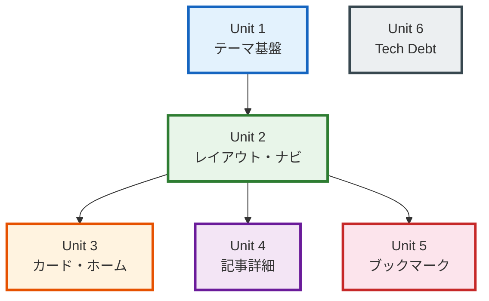

# Unit of Work Dependencies

## Dependency Matrix



### Text Alternative
```
Unit 1 (テーマ基盤) → Unit 2 (レイアウト・ナビ) → Unit 3 (カード・ホーム)
                                                  → Unit 4 (記事詳細)
                                                  → Unit 5 (ブックマーク)
Unit 6 (Tech Debt) → (独立、Unit 1 と並行実行)
```

---

## Dependency Details

### Unit 1 → Unit 2
| Dependency | Type | Description |
|-----------|------|-------------|
| theme.ts | Import | Unit 2 の Header が ThemeToggle を配置。ThemeToggle は theme.ts に依存 |
| ThemeScript | Inline | Unit 2 の BaseLayout 調整が ThemeScript の存在を前提とする |
| Tailwind darkMode | Config | Unit 2 の全スタイルが `dark:` バリアント使用 |
| CSS Variables | Style | Unit 2 のカラー定義が CSS 変数に依存 |

### Unit 2 → Unit 3
| Dependency | Type | Description |
|-----------|------|-------------|
| BaseLayout | Composition | index.astro が BaseLayout を使用 |
| Header | Composition | ナビゲーション構造が確定している必要がある |
| TabNavigation | Composition | index.astro が TabNavigation を組み込む |
| Theme styles | Style | ArticleCard がテーマ対応スタイルを使用 |

### Unit 2 → Unit 4
| Dependency | Type | Description |
|-----------|------|-------------|
| BaseLayout | Composition | blog/[id].astro が BaseLayout を使用 |
| Theme styles | Style | 全コンポーネントがテーマ対応スタイルを使用 |

### Unit 2 → Unit 5
| Dependency | Type | Description |
|-----------|------|-------------|
| BaseLayout | Composition | bookmarks.astro が BaseLayout を使用 |
| Header | Navigation | ブックマークページへのナビリンク |
| Theme styles | Style | BookmarkButton がテーマ対応スタイルを使用 |

### Unit 6 (Independent)
| Dependency | Type | Description |
|-----------|------|-------------|
| (none) | - | 他ユニットとの依存関係なし。Unit 1 と並行実行可能 |

---

## Cross-Unit Dependencies (Weak)

以下はユニット間の弱い結合で、実装順序には影響しないが認識が必要。

| Source Unit | Target Unit | Component | Type | Description |
|-------------|-------------|-----------|------|-------------|
| Unit 4 | Unit 5 | StickyReactionBar → BookmarkButton | Composition | Unit 4 で BookmarkButton 統合。Unit 5 未完了時はプレースホルダー使用 |
| Unit 3 | Unit 5 | ArticleCard → bookmarkCount | Props | カードにブックマーク数表示。Unit 5 未完了時は 0 表示 |

### Cross-Unit Integration Strategy
- **Unit 4 ↔ Unit 5**: StickyReactionBar に BookmarkButton のスロット/プレースホルダーを先に用意。Unit 5 完了後に実コンポーネントを統合
- **Unit 3 ↔ Unit 5**: ArticleCard の bookmarkCount prop はオプショナル（`bookmarkCount?: number`）。Unit 5 未完了時は表示しない

---

## Execution Phases

### Phase 1: 基盤構築（並行）
```
+-------------------+    +-------------------+
| Unit 1            |    | Unit 6            |
| テーマ基盤        |    | Tech Debt         |
| (theme.ts,        |    | (Firebase null,   |
|  ThemeToggle,     |    |  Webhook sig,     |
|  ThemeScript,     |    |  Script extract)  |
|  CSS vars)        |    |                   |
+-------------------+    +-------------------+
```

### Phase 2: レイアウト
```
+-------------------+
| Unit 2            |
| レイアウト・ナビ  |
| (Header, Footer,  |
|  TabNav, Layout)  |
+-------------------+
```

### Phase 3: 機能実装（並行）
```
+-------------------+    +-------------------+    +-------------------+
| Unit 3            |    | Unit 4            |    | Unit 5            |
| カード・ホーム    |    | 記事詳細          |    | ブックマーク      |
| (ArticleCard,     |    | (Typography,      |    | (API, Button,     |
|  Hero, index,     |    |  TOC, Reactions,  |    |  Page)            |
|  Stats)           |    |  StickyBar)       |    |                   |
+-------------------+    +-------------------+    +-------------------+
```

### Phase 4: 統合
```
+-------------------------------------------+
| Build & Test                              |
| (全ユニット統合テスト、                   |
|  ライト/ダーク両テーマ確認、             |
|  レスポンシブ確認)                        |
+-------------------------------------------+
```
