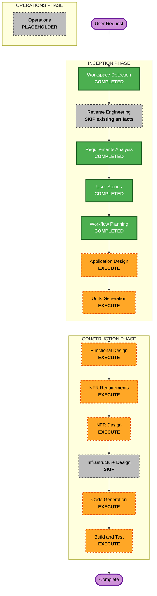

# 実行計画: 執筆環境 / CMS 戦略

## 詳細分析サマリー

### 変更範囲

- **変更種別**: 既存アプリケーションのアーキテクチャ変更
- **主な変更**:
  - ブログ記事の取得元を microCMS から Git 管理の Markdown / MDX へ移行する。
  - プロフィールとプロジェクトは初期 MVP では microCMS に残し、コンテンツ取得層の責務を分離する。
  - 記事 frontmatter、下書き除外、プレビュー、PR 公開フロー、既存記事移行を扱う。
- **関連コンポーネント**:
  - `src/lib/microcms.ts`
  - 新規の記事取得層
  - `src/pages/index.astro`
  - `src/pages/blog/index.astro`
  - `src/pages/blog/[id].astro`
  - `src/pages/category/index.astro`
  - `src/pages/category/[categoryName].astro`
  - `src/pages/search.astro`
  - `src/pages/rss.xml.ts`
  - `astro.config.mjs`
  - Firebase 連携周辺
  - テスト一式

### 影響評価

- **ユーザー向け変更**: あり。著者の執筆、プレビュー、公開フローが変わる。
- **構造変更**: あり。ブログ記事データの取得元が microCMS 依存から Markdown / MDX ベースへ変わる。
- **データモデル変更**: あり。ブログ記事を frontmatter + Markdown / MDX 本文として管理する。
- **API 変更**: 限定的。初期 MVP では新規公開 API は必須ではないが、既存 API と Firebase 連携の ID 互換性に影響する。
- **NFR 影響**: あり。下書き漏えい防止、frontmatter 検証、PR 履歴、依存追加、ビルド安定性を扱う。

### コンポーネント関係

- **主要コンポーネント**: 新規 Markdown / MDX 記事ソース層
- **インフラ構成**: 既存の GitHub PR / Vercel / Astro SSR を利用する。初期 MVP では新規クラウドリソースは想定しない。
- **共有コンポーネント**: Article 型、frontmatter schema、reading time、related posts、category utilities
- **依存コンポーネント**: Home、ブログ一覧、ブログ詳細、カテゴリページ、検索、RSS、sitemap、ArticleCard、関連記事
- **支援コンポーネント**: Vitest、Playwright、GitHub PR review、Vercel deployment

### リスク評価

- **リスクレベル**: High
- **ロールバック複雑度**: Moderate
- **テスト複雑度**: Complex
- **主なリスク**:
  - 下書き記事が公開面、RSS、sitemap、検索に混入する。
  - 既存 URL、記事 ID、Firebase 統計との互換性が崩れる。
  - Markdown / MDX 変換後の本文表示やコードブロックが崩れる。
  - microCMS 記事移行でカテゴリ、公開日、アイキャッチ参照が欠落する。

## ワークフロー可視化

### Mermaid 図

### テキスト代替

1. Workspace Detection: 完了
2. Reverse Engineering: 既存成果物を利用するためスキップ
3. Requirements Analysis: 完了
4. User Stories: 完了
5. Workflow Planning: 完了
6. Application Design: 実行
7. Units Generation: 実行
8. Functional Design: 実行
9. NFR Requirements: 実行
10. NFR Design: 実行
11. Infrastructure Design: MVP ではスキップ
12. Code Generation: 実行
13. Build and Test: 実行

## 実行対象フェーズ

### INCEPTION PHASE

- [x] Workspace Detection - 完了
- [x] Reverse Engineering - 既存成果物を利用するためスキップ
- [x] Requirements Analysis - 完了
- [x] User Stories - 完了
- [x] Workflow Planning - 完了
- [ ] Application Design - EXECUTE
  - **理由**: 新しい記事取得層、frontmatter schema、既存 microCMS 取得層との責務分離、ページ群との依存関係を設計する必要がある。
- [ ] Units Generation - EXECUTE
  - **理由**: 記事基盤、ページ統合、移行、プレビュー、テストを独立した作業単位へ分割する必要がある。

### CONSTRUCTION PHASE

- [ ] Functional Design - EXECUTE
  - **理由**: 記事 schema、公開判定、下書き除外、ID 互換、移行処理の business logic を明確にする。
- [ ] NFR Requirements - EXECUTE
  - **理由**: Security Baseline が有効であり、下書き漏えい、認証、トークン、PR 完全性、性能、テスト容易性を扱う。
- [ ] NFR Design - EXECUTE
  - **理由**: fail closed、入力検証、最小権限、依存追加、ビルド時検証の設計が必要。
- [ ] Infrastructure Design - SKIP
  - **理由**: 初期 MVP は既存 GitHub PR / Vercel / Astro SSR を利用し、新規クラウドリソースやネットワーク設計を前提にしない。
- [ ] Code Generation - EXECUTE
  - **理由**: 実装が必要。
- [ ] Build and Test - EXECUTE
  - **理由**: 記事取得層、下書き除外、移行、RSS / sitemap、既存ページ表示の検証が必要。

### OPERATIONS PHASE

- [ ] Operations - PLACEHOLDER
  - **理由**: 現在の AI-DLC では将来拡張枠。初期 MVP では Build and Test までを対象にする。

## 推奨ユニット

### Unit 1: Markdown / MDX 記事ソース基盤

- Article frontmatter schema
- Article 型
- Markdown / MDX 記事取得 API
- draft / published 判定
- validation の unit tests

### Unit 2: 公開ページ統合と公開面フィルタリング

- Home、ブログ一覧、ブログ詳細、カテゴリ、検索
- RSS と sitemap
- ArticleCard / related posts 互換
- 全公開面での draft 除外

### Unit 3: プレビューと PR 公開フロー

- local preview の前提整理
- Vercel Preview 互換
- PR workflow document
- 将来の GitHub OAuth / 管理 UI 拡張点

### Unit 4: microCMS ブログ移行

- 移行戦略、スクリプト、または手順
- ID / slug / publishedAt / category / eyecatch の維持
- Firebase stats との互換
- 二重公開防止

### Unit 5: セキュリティ、テスト、ドキュメント

- Security Baseline checks
- frontmatter と draft filtering tests
- migration tests
- build / test instructions
- authoring guide

## パッケージ変更順序

1. **コンテンツモデルと取得層**
   - ページを変更する前に schema と取得境界を作る。
2. **公開ページ統合**
   - 取得層が安定してからページ単位の記事取得を置き換える。
3. **公開面の安全性**
   - 一覧、詳細、RSS、sitemap、検索で下書き除外を徹底する。
4. **移行サポート**
   - 移行先 schema が固まってから移行戦略を追加する。
5. **検証とドキュメント**
   - 挙動実装後にテストと執筆手順を追加する。

## 見積もり

- **コード前に残る INCEPTION stages**: 2
- **Construction design stages**: 3 実行、1 スキップ
- **実装ユニット**: 5 推奨
- **期間感**: 複数セッション想定。MVP は小さく保つが、共有コンテンツ挙動に広く影響する。

## Quality Gates

- Application Design を承認してから Units Generation へ進む。
- Units Generation を承認してから Construction へ進む。
- 必要に応じて unit ごとの design を承認してから code generation へ進む。
- 生成コードは関連 unit tests を通す。
- Build で公開ページ、RSS、sitemap、下書き除外を検証する。
- Security Baseline の blocking finding が出た場合は次へ進む前に解消する。

## Security Compliance

| Rule | Workflow Planning Status | Notes |
|---|---|---|
| SECURITY-01 | N/A | 初期 MVP では新規永続化ストアを追加しない。 |
| SECURITY-02 | N/A | 初期 MVP では新規ネットワーク仲介層を追加しない。 |
| SECURITY-03 | Applicable later | 移行処理や将来 API を実装する場合に構造化ログを扱う。 |
| SECURITY-04 | Applicable later | プレビュー / 管理画面を追加する場合に確認する。 |
| SECURITY-05 | Applicable later | frontmatter、移行入力、API 入力の検証で扱う。 |
| SECURITY-06 | Applicable later | GitHub / Vercel / token scope を扱う。 |
| SECURITY-07 | N/A | ネットワーク構成変更なし。 |
| SECURITY-08 | Applicable later | 下書きプレビューや将来管理 UI の認可で扱う。 |
| SECURITY-09 | Applicable later | エラー表示、公開設定、不要な公開面露出を扱う。 |
| SECURITY-10 | Applicable later | 依存追加や CI チェック時に扱う。 |
| SECURITY-11 | Applicable later | 認証、公開判定、下書き除外の責務分離で扱う。 |
| SECURITY-12 | Applicable later | 将来 GitHub OAuth を実装する場合に扱う。 |
| SECURITY-13 | Applicable later | PR 履歴、Git 履歴、移行の完全性で扱う。 |
| SECURITY-14 | Applicable later | 管理操作や認可失敗の監視は後続設計で検討する。 |
| SECURITY-15 | Applicable later | 記事取得、移行、外部 API を fail closed にする。 |

**Blocking Security Findings**: Workflow Planning 時点ではなし。

## Content Validation

- Mermaid node IDs は ASCII の識別子を使っている。
- Mermaid labels は引用符で囲み、未エスケープの引用符を避けている。
- テキスト代替を含めている。
- ASCII box diagram は使っていない。
