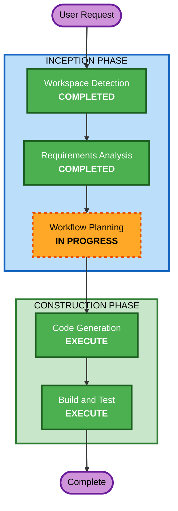

# Execution Plan - Homepage Branding Improvement

## Detailed Analysis Summary

### Transformation Scope

- **Transformation Type**: Single component UI change
- **Primary Changes**: ホームページヒーローセクションのテキスト・アニメーション変更
- **Related Components**: なし（自己完結的な変更）

### Change Impact Assessment

- **User-facing changes**: Yes — h1テキスト、副題テキスト、入場アニメーション追加
- **Structural changes**: No — 既存コンポーネント構造の変更なし
- **Data model changes**: No
- **API changes**: No
- **NFR impact**: Minimal — アクセシビリティ（prefers-reduced-motion）対応のみ

### Component Relationships

- **Primary Component**: `src/pages/index.astro` (ヒーローセクション)
- **Supporting**: `src/styles/main.scss` (アニメーション @keyframes)
- **依存関係**: Swup ページ遷移との連携（アニメーション再トリガー）

### Risk Assessment

- **Risk Level**: Low
- **Rollback Complexity**: Easy（テキストとCSS変更のみ）
- **Testing Complexity**: Simple（目視確認 + ビルド検証）

## Workflow Visualization

## Phases to Execute

### INCEPTION PHASE

- [x] Workspace Detection (COMPLETED)
- [ ] Reverse Engineering (SKIP - 既存成果物あり)
- [x] Requirements Analysis (COMPLETED)
- [ ] User Stories (SKIP)
  - **Rationale**: 小規模UI変更、単一ユーザー影響、ペルソナ不要
- [x] Workflow Planning (IN PROGRESS)
- [ ] Application Design (SKIP)
  - **Rationale**: 新規コンポーネントなし、既存 index.astro 内の変更のみ
- [ ] Units Generation (SKIP)
  - **Rationale**: 単一ユニット、分割不要

### CONSTRUCTION PHASE

- [ ] Functional Design (SKIP)
  - **Rationale**: 複雑なビジネスロジックなし、テキスト変更 + CSS アニメーション
- [ ] NFR Requirements (SKIP)
  - **Rationale**: NFR は最小限（prefers-reduced-motion）で Code Generation 内で対応可能
- [ ] NFR Design (SKIP)
  - **Rationale**: NFR Requirements スキップに連動
- [ ] Infrastructure Design (SKIP)
  - **Rationale**: インフラ変更なし
- [ ] Code Generation (EXECUTE)
  - **Rationale**: h1/副題テキスト変更、タイピングアニメーション実装、Swup 対応
- [ ] Build and Test (EXECUTE)
  - **Rationale**: ビルド検証、既存テスト通過確認

### OPERATIONS PHASE

- [ ] Operations (PLACEHOLDER)

## Change Sequence (Single Unit)

### Unit: Homepage Hero Branding

**変更対象ファイル**:

| File | Change Type | Description |
|------|-------------|-------------|
| `src/pages/index.astro` | Modify | h1テキスト変更、副題変更、アニメーション用マークアップ、Swup再トリガーJS |
| `src/styles/main.scss` | Modify | @keyframes タイピングアニメーション、フェードイン、reduced-motion対応 |

**実装ステップ概要**:
1. 副題テキスト候補の確定（ユーザーと相談）
2. h1 を「Monologger」に変更 + pageTitle 調整
3. 副題をミニマルな一言に変更
4. CSS タイピングアニメーション実装
5. フェードイン入場アニメーション実装
6. prefers-reduced-motion 対応
7. Swup ページ遷移時の再トリガー対応
8. ビルド & テスト検証

## Success Criteria

- **Primary Goal**: 「気づきメモ」→「Monologger」ブランドへの刷新
- **Key Deliverables**:
  - h1: 「Monologger」+ タイピングアニメーション
  - 副題: ミニマルな一言キャッチ
  - ダーク/ライトテーマ両対応
  - アクセシビリティ対応（reduced-motion）
- **Quality Gates**:
  - Vite ビルド成功
  - 既存テスト全パス
  - ダーク/ライトテーマで目視確認
