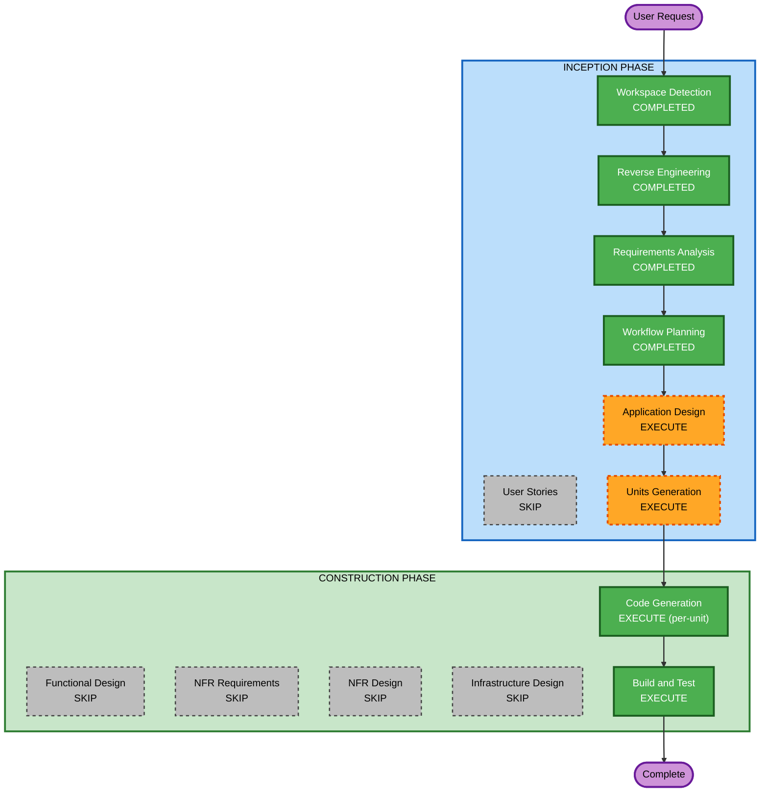

# Execution Plan

## Detailed Analysis Summary

### Transformation Scope
- **Transformation Type**: Architectural（UI/UX全面刷新 + テーマシステム追加 + 技術的負債解消）
- **Primary Changes**: Zenn.dev インスパイアのUI/UX再設計、ライト/ダークテーマ切替、ブックマーク機能完成
- **Related Components**: 全ページ（13）、全コンポーネント（19）、API（4）、レイアウト、スタイル

### Change Impact Assessment
- **User-facing changes**: Yes - 全ページのデザイン変更、テーマ切替、新機能（ブックマーク）
- **Structural changes**: Yes - テーマシステム導入、コンポーネント構造の一部変更
- **Data model changes**: No - Firestore/microCMS のスキーマ変更なし
- **API changes**: Yes - Bookmarks API 新規追加、Webhook署名検証の強化
- **NFR impact**: Yes - パフォーマンス（テーマ切替FOUC防止）、アクセシビリティ（両テーマのコントラスト）

### Component Relationships
- **Primary Component**: BaseLayout.astro（テーマシステムの根幹）
- **High Impact**: 全 .astro ページ（Tailwind dark: クラス追加）、main.scss
- **Medium Impact**: React Islands（テーマ対応スタイル）
- **Low Impact**: API routes（UI非依存、技術的負債修正のみ）

### Risk Assessment
- **Risk Level**: Medium
- **Rollback Complexity**: Moderate（テーマシステムが全コンポーネントに波及するため、個別ロールバックは困難。ユニット単位で段階的に適用することでリスク軽減）
- **Testing Complexity**: Complex（ライト/ダーク両テーマの全ページ確認が必要）

---

## Workflow Visualization



### Text Alternative
```
Phase 1: INCEPTION
- Workspace Detection (COMPLETED)
- Reverse Engineering (COMPLETED)
- Requirements Analysis (COMPLETED)
- User Stories (SKIP)
- Workflow Planning (COMPLETED)
- Application Design (EXECUTE)
- Units Generation (EXECUTE)

Phase 2: CONSTRUCTION
- Functional Design (SKIP, per-unit)
- NFR Requirements (SKIP, per-unit)
- NFR Design (SKIP, per-unit)
- Infrastructure Design (SKIP, per-unit)
- Code Generation (EXECUTE, per-unit)
- Build and Test (EXECUTE)
```

---

## Phases to Execute

### INCEPTION PHASE
- [x] Workspace Detection (COMPLETED)
- [x] Reverse Engineering (COMPLETED)
- [x] Requirements Analysis (COMPLETED)
- [x] User Stories - SKIP
  - **Rationale**: 個人ブログの改善であり、複数ペルソナやチーム協業は不要。要件分析で十分な情報が得られている
- [x] Workflow Planning (COMPLETED)
- [ ] Application Design - **EXECUTE**
  - **Rationale**: テーマシステムという新しい横断的機能の導入、レイアウト再設計、ブックマーク機能の新規コンポーネントなど、コンポーネント設計が必要
- [ ] Units Generation - **EXECUTE**
  - **Rationale**: 大規模改修のため、複数のユニット（テーマ基盤、レイアウト、カード、記事詳細、ブックマーク、技術的負債）に分割して段階的に実装する必要がある

### CONSTRUCTION PHASE (per-unit)
- [ ] Functional Design - **SKIP**
  - **Rationale**: 複雑なビジネスロジックの新規追加はなし。ブックマークは既存リアクションAPIパターンの踏襲で十分
- [ ] NFR Requirements - **SKIP**
  - **Rationale**: NFRは Requirements Analysis で定義済み。新たな NFR 検討は不要
- [ ] NFR Design - **SKIP**
  - **Rationale**: NFR Requirements をスキップするため
- [ ] Infrastructure Design - **SKIP**
  - **Rationale**: インフラ変更なし（Vercel + Firebase + microCMS 継続）
- [ ] Code Generation - **EXECUTE** (per-unit, ALWAYS)
  - **Rationale**: 各ユニットのコード実装が必要
- [ ] Build and Test - **EXECUTE** (ALWAYS)
  - **Rationale**: 全ユニット完了後のビルド・テスト検証

### OPERATIONS PHASE
- [ ] Operations - PLACEHOLDER

---

## Module Update Strategy
- **Update Approach**: Sequential（テーマ基盤 → レイアウト → 各ページ/コンポーネントの順）
- **Critical Path**: テーマシステム → BaseLayout → 各ページ
- **Coordination Points**: Tailwind darkMode 設定、CSS変数、テーマ状態管理
- **Testing Checkpoints**: 各ユニット完了後にライト/ダーク両テーマでの表示確認

---

## Proposed Unit Breakdown (Preliminary)

以下は Application Design / Units Generation で詳細化するが、現時点での仮分割:

| Unit | 内容 | 依存関係 |
|------|------|----------|
| **Unit 1**: テーマ基盤 | Tailwind darkMode設定、テーマ切替ロジック、CSS変数、FOUC防止 | なし（最初に実装） |
| **Unit 2**: レイアウト・ナビ | BaseLayout再設計、Header/Footer改善、タブナビ | Unit 1 |
| **Unit 3**: 記事カード・ホーム | ArticleCard再設計、ホームページレイアウト、ヒーロー簡素化 | Unit 1, 2 |
| **Unit 4**: 記事詳細 | 記事ページ改善、目次UX、リアクションUI、インラインスクリプト分離 | Unit 1, 2 |
| **Unit 5**: ブックマーク | Bookmarks API完成、ブックマークUI、一覧ページ | Unit 1, 2 |
| **Unit 6**: 技術的負債 | Firebase nullチェック、Webhook署名検証、その他修正 | なし（独立実施可能） |

---

## Success Criteria
- **Primary Goal**: Zenn.dev にインスパイアされた、クリーンで読みやすいUI/UXの実現
- **Key Deliverables**:
  - ライト/ダークテーマ切替機能
  - Zenn風のシンプルなレイアウト
  - ブックマーク機能の完全実装
  - 全技術的負債の解消
- **Quality Gates**:
  - ライト/ダーク両テーマで全ページが正しく表示される
  - Core Web Vitals スコアが現状以上
  - WCAG 2.1 AA 準拠（両テーマ）
  - 既存テストが全パス
  - ブックマーク API のテスト追加
