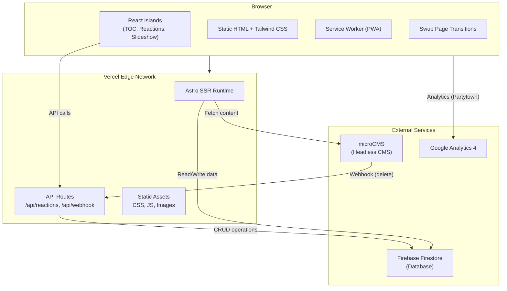
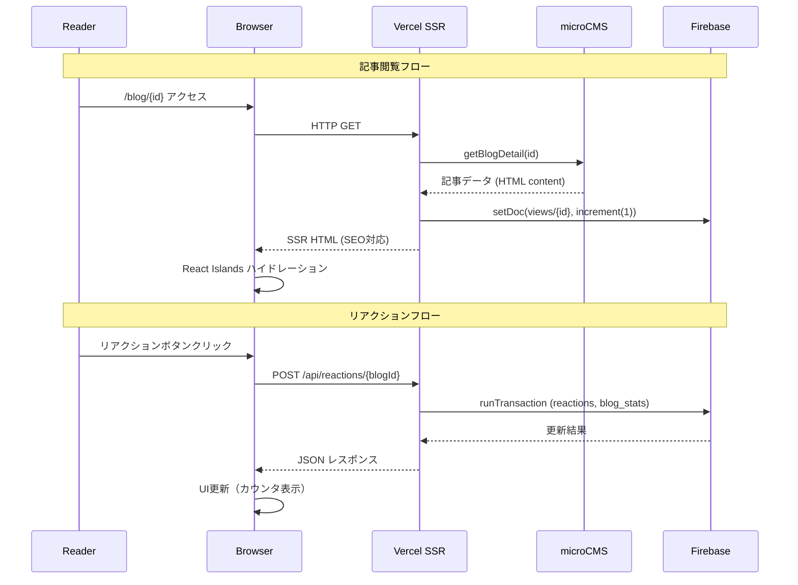

# System Architecture

## System Overview

Monologger は Astro フレームワーク（SSR モード）をベースとした技術ブログシステムです。コンテンツ管理に microCMS、動的データの永続化に Firebase Firestore、ホスティングに Vercel を使用する JAMstack + Islands Architecture パターンで構築されています。

## Architecture Diagram

## Component Descriptions

### Astro SSR Runtime
- **Purpose**: サーバーサイドレンダリングによるHTML生成
- **Responsibilities**: ページルーティング、コンテンツフェッチ、SEOメタタグ生成、構造化データ埋め込み
- **Dependencies**: microCMS SDK, Firebase SDK, Cheerio
- **Type**: Application

### React Islands
- **Purpose**: インタラクティブなUI機能（部分的ハイドレーション）
- **Responsibilities**: TOCスクロール連動、リアクションUI、ヒーロースライドショー、カテゴリフィルター
- **Dependencies**: React 19, Firebase（間接的にAPI経由）
- **Type**: Application (Client-side)

### API Routes
- **Purpose**: サーバーサイドAPI（Vercel Serverless Functions として実行）
- **Responsibilities**: リアクションCRUD、microCMS Webhook処理、Firebase データ操作
- **Dependencies**: Firebase Firestore SDK
- **Type**: Application (Server-side)

### microCMS Integration Layer
- **Purpose**: ヘッドレスCMSとのデータ連携
- **Responsibilities**: 記事取得、プロフィール取得、プロジェクト取得、データ正規化
- **Dependencies**: microcms-js-sdk
- **Type**: Shared (Library)

### Firebase Integration Layer
- **Purpose**: リアルタイムデータベースとの連携
- **Responsibilities**: Firestore初期化、コレクション定義、nullable安全なエクスポート
- **Dependencies**: Firebase SDK
- **Type**: Shared (Library)

## Data Flow

## Integration Points

### External APIs
- **microCMS API**: 記事（blogs）、プロフィール（profile）、プロジェクト（projects）の取得。READ権限のみのAPIキーで運用
- **Google Analytics 4**: Partytownによるオフロード実行。Web Vitals監視を含む

### Databases
- **Firebase Firestore**: 4コレクション
  - `views`: 閲覧カウント（記事ID → count）
  - `reactions`: 個別リアクション記録（userId, blogId, reactionType）
  - `blog_stats`: 記事統計集約（reactionCounts, viewCount, bookmarkCount）
  - `bookmarks`: ブックマーク（プレースホルダー・実装途中）

### Third-party Services
- **Vercel**: SSR ホスティング + Edge Network + Serverless Functions
- **microCMS Webhook**: 記事削除時のFirebaseクリーンアップトリガー

## Infrastructure Components

### Deployment Model
- **Platform**: Vercel (Serverless)
- **SSR Adapter**: @astrojs/vercel
- **CDN**: Vercel Edge Network（グローバル配信）
- **Build**: Astro + Vite（Critters による Critical CSS inlining）

### Environment Variables
- `VITE_MICROCMS_SERVICE_DOMAIN`: microCMS サービスドメイン
- `MICROCMS_READ_API_KEY`: microCMS 読み取りAPIキー
- `VITE_FIREBASE_*`: Firebase 設定（7変数）
- `MICROCMS_WEBHOOK_SECRET`: Webhook署名検証用シークレット
