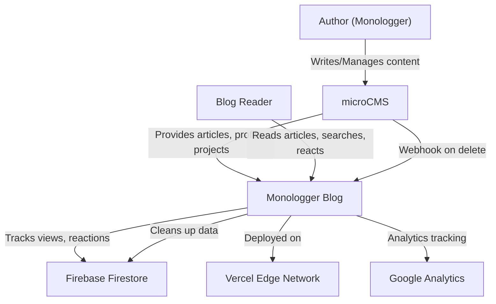

# Business Overview

## Business Context Diagram

## Business Description

- **Business Description**: Monologger は、IT・AI・ガジェットに関する個人の「気づき」や備忘録をゆるく記録するテックブログです。著者（Monologger）が日々の技術的発見を共有し、読者がサクッと読める形でヒントを提供することを目的としています。
- **Business Transactions**:
  1. **記事閲覧**: 読者がブログ記事を閲覧し、閲覧数が自動カウントされる
  2. **記事検索**: 読者がキーワードで記事を検索する
  3. **カテゴリ閲覧**: 読者がカテゴリ別に記事を絞り込む
  4. **リアクション**: 読者が記事に対して4種類のリアクション（いいね、参考になった、深い洞察、インスパイア）を付ける
  5. **記事共有**: 読者がX(Twitter)やLinkedInで記事をシェアする
  6. **コンテンツ管理**: 著者がmicroCMSで記事を作成・編集・削除する
  7. **データ同期**: microCMSでの記事削除時にFirebaseの関連データを自動クリーンアップ
  8. **RSS購読**: 読者がRSSフィードで最新記事を購読する
  9. **ポートフォリオ閲覧**: 訪問者が著者のプロフィール・プロジェクト実績を確認する
- **Business Dictionary**:
  - **Monologger**: mono（ひとりごと）+ logger（記録）。サイト名・著者ペルソナ
  - **気づきメモ**: 記事のコンセプト。大掛かりなチュートリアルではなく、日常の小さな発見の記録
  - **リアクション**: 記事への読者フィードバック。4種類のエモジ（👍💡🎯✨）で表現
  - **アイキャッチ**: 記事のサムネイル画像。microCMSで管理
  - **カテゴリ**: 記事の分類タグ（例: AI, ガジェット, Web開発など）

## Component Level Business Descriptions

### microCMS Integration (src/lib/microcms.ts)
- **Purpose**: コンテンツ管理システムから記事・プロフィール・プロジェクト情報を取得する
- **Responsibilities**: API通信、データ正規化（カテゴリ配列化）、参照共有防止（deepCopy）

### Firebase Integration (src/lib/firebase.ts, firebase-collections.ts)
- **Purpose**: リアルタイムデータの永続化（閲覧数、リアクション、ブックマーク、統計情報）
- **Responsibilities**: Firestore初期化、コレクション定義、型安全なデータモデル提供

### Reaction System (src/pages/api/reactions/[blogId].ts)
- **Purpose**: 読者の記事へのエンゲージメントを計測・管理する
- **Responsibilities**: リアクションの追加/削除/トグル、統計の原子的更新（Firestore Transaction）

### Content Sync (src/pages/api/webhook/microcms-sync.ts)
- **Purpose**: microCMSとFirebase間のデータ整合性を維持する
- **Responsibilities**: Webhook受信、署名検証、関連Firestoreドキュメントのクリーンアップ

### Article Display (src/pages/blog/[id].astro)
- **Purpose**: 記事を読者に最適な形で表示する
- **Responsibilities**: SEO対応、目次生成、閲覧数カウント、関連記事推薦、シェア機能

### Search (src/pages/search.astro)
- **Purpose**: 読者が必要な記事を素早く見つけられるようにする
- **Responsibilities**: キーワード検索、検索履歴管理、カテゴリフィルタリング
