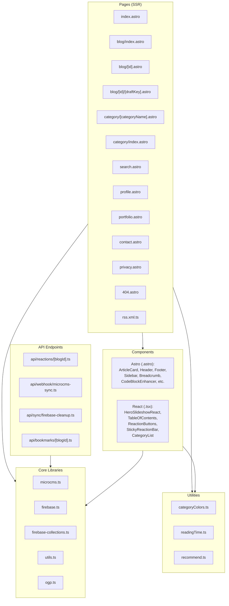

# Code Structure

## Build System
- **Type**: npm (Astro + Vite 7)
- **Configuration**: package.json, astro.config.mjs, tailwind.config.mjs, tsconfig.json
- **Scripts**: dev, build, preview, test, e2e, lint, format

## Key Modules

## Existing Files Inventory

### Pages (src/pages/)
- `index.astro` - ホームページ（ヒーロースライドショー + 最新記事一覧 + ページネーション）
- `blog/index.astro` - ブログ一覧（フィルター・ソート機能付き）
- `blog/[id].astro` - 記事詳細（TOC、リアクション、関連記事、シェア、閲覧カウント）
- `blog/[id]/[draftKey].astro` - 下書きプレビュー
- `category/index.astro` - カテゴリ一覧
- `category/[categoryName].astro` - カテゴリ別記事一覧
- `search.astro` - 検索ページ
- `profile.astro` - 著者プロフィール
- `portfolio.astro` - ポートフォリオ
- `contact.astro` - お問い合わせ
- `privacy.astro` - プライバシーポリシー
- `404.astro` - エラーページ
- `rss.xml.ts` - RSSフィード生成

### API Endpoints (src/pages/api/)
- `reactions/[blogId].ts` - リアクション API（GET/POST）
- `webhook/microcms-sync.ts` - microCMS Webhook（記事削除同期）
- `bookmarks/[blogId].ts` - ブックマーク API（プレースホルダー）
- `sync/firebase-cleanup.ts` - Firebase データクリーンアップ

### Components (src/components/)

**Astro Components（静的）:**
- `ArticleCard.astro` - 記事カード（グリッド/リスト両対応）
- `ArticleNavigation.astro` - 前後記事ナビゲーション
- `AuthorCard.astro` - 著者情報カード
- `Breadcrumb.astro` - パンくずナビゲーション（Schema.org対応）
- `CodeBlockEnhancer.astro` - コードブロック強化（コピーボタン、言語ラベル）
- `Comments.astro` - コメントセクション
- `Footer.astro` - フッター
- `Header.astro` - ヘッダー（モバイルメニュー付き）
- `ImageOptimizer.astro` - 画像最適化（遅延読み込み、ライトボックス）
- `KeyboardNavigation.astro` - キーボードショートカット
- `LinkCard.astro` - 外部リンクカード
- `LinkStyleEnhancer.astro` - リンクスタイル強化
- `ProjectCard.astro` - ポートフォリオ用プロジェクトカード
- `Sidebar.astro` - サイドバー（カテゴリ + 人気記事）

**React Components（インタラクティブ）:**
- `HeroSlideshowReact.tsx` - ヒーロースライドショー（client:idle）
- `TableOfContents.tsx` - 目次（scrollspy + アクティブハイライト、client:load）
- `ReactionButtons.tsx` - リアクションボタン群（client:load）
- `StickyReactionBar.tsx` - 固定リアクションバー（PC用、client:load）
- `CategoryList.tsx` - カテゴリフィルターリスト

### Core Libraries (src/lib/)
- `microcms.ts` - microCMS API クライアント（型定義 + CRUD関数）
- `firebase.ts` - Firebase 初期化（null-safe パターン）
- `firebase-collections.ts` - Firestoreコレクション型定義・定数
- `utils.ts` - 共通ユーティリティ（sessionId生成、normalizeToArray、deepCopy）
- `ogp.ts` - OGP情報のスクレイピング

### Utilities (src/utils/)
- `categoryColors.ts` - カテゴリ別カラーマッピング（Zenn風バッジ）
- `readingTime.ts` - 読了時間計算（日本語・英語対応）
- `recommend.ts` - 関連記事推薦アルゴリズム

### Layout (src/layouts/)
- `BaseLayout.astro` - グローバルレイアウト（SEO、OGP、GA、Swup、ServiceWorker）

### Styles (src/styles/)
- `main.scss` - グローバルスタイル（記事本文、TOC、リアクション等）

## Design Patterns

### Islands Architecture
- **Location**: 全React components（.tsx）
- **Purpose**: 部分的ハイドレーションによるパフォーマンス最適化
- **Implementation**: `client:load`（即座に必要）と `client:idle`（遅延可能）の使い分け

### Null-safe Firebase Initialization
- **Location**: src/lib/firebase.ts
- **Purpose**: Firebase設定が不完全でもアプリがクラッシュしない
- **Implementation**: 設定検証→条件付き初期化→nullable export→利用側でnullチェック

### Deep Copy for Data Isolation
- **Location**: src/lib/microcms.ts
- **Purpose**: microCMS SDKの参照共有問題を回避
- **Implementation**: JSON.parse(JSON.stringify()) によるディープコピー

### Atomic Stats Updates
- **Location**: src/pages/api/reactions/[blogId].ts
- **Purpose**: リアクションカウントの整合性保証
- **Implementation**: Firestore runTransaction による原子的更新

## Critical Dependencies

### astro (v5.10.2)
- **Version**: ^5.10.2
- **Usage**: コアフレームワーク（SSR、ルーティング、ビルド）
- **Purpose**: Islands Architecture によるハイブリッドレンダリング

### react (v19.2.0)
- **Version**: ^19.2.0
- **Usage**: インタラクティブコンポーネント
- **Purpose**: TOC、リアクション、スライドショー等の動的UI

### microcms-js-sdk (v3.3.0)
- **Version**: ^3.3.0
- **Usage**: src/lib/microcms.ts
- **Purpose**: microCMS API との型安全な通信

### firebase (v11.9.0)
- **Version**: ^11.9.0
- **Usage**: src/lib/firebase.ts, API routes
- **Purpose**: Firestore によるリアルタイムデータ管理

### cheerio (v1.2.0)
- **Version**: ^1.2.0
- **Usage**: 記事詳細ページ、OGPスクレイピング
- **Purpose**: サーバーサイドHTML解析（目次生成、OGP取得）

### swup (v4.8.2)
- **Version**: ^4.8.2
- **Usage**: BaseLayout.astro
- **Purpose**: SPAライクなページ遷移（アニメーション付き）
