# Dependencies

## Internal Dependencies

```mermaid
graph TD
    subgraph Pages
        Index["index.astro"]
        BlogDetail["blog/[id].astro"]
        BlogList["blog/index.astro"]
        CategoryPage["category/[name].astro"]
        SearchPage["search.astro"]
        ProfilePage["profile.astro"]
        PortfolioPage["portfolio.astro"]
    end

    subgraph APIRoutes
        ReactionsAPI["api/reactions/[blogId].ts"]
        WebhookAPI["api/webhook/microcms-sync.ts"]
    end

    subgraph Components
        ArticleCard["ArticleCard.astro"]
        HeroSlideshow["HeroSlideshowReact.tsx"]
        TOC["TableOfContents.tsx"]
        ReactionBtns["ReactionButtons.tsx"]
        StickyBar["StickyReactionBar.tsx"]
        CategoryListComp["CategoryList.tsx"]
        Sidebar["Sidebar.astro"]
        AuthorCard["AuthorCard.astro"]
    end

    subgraph Lib
        MicroCMS["microcms.ts"]
        Firebase["firebase.ts"]
        FireColl["firebase-collections.ts"]
        Utils["utils.ts"]
    end

    subgraph Utilities
        CatColors["categoryColors.ts"]
        ReadTime["readingTime.ts"]
        Recommend["recommend.ts"]
    end

    subgraph Layout
        BaseLayout["BaseLayout.astro"]
    end

    Index --> MicroCMS
    Index --> Firebase
    Index --> HeroSlideshow
    Index --> ArticleCard
    Index --> Sidebar
    Index --> BaseLayout

    BlogDetail --> MicroCMS
    BlogDetail --> Firebase
    BlogDetail --> TOC
    BlogDetail --> ReactionBtns
    BlogDetail --> StickyBar
    BlogDetail --> ArticleCard
    BlogDetail --> AuthorCard
    BlogDetail --> Recommend
    BlogDetail --> CatColors
    BlogDetail --> BaseLayout

    BlogList --> MicroCMS
    BlogList --> CategoryListComp
    BlogList --> ArticleCard
    BlogList --> BaseLayout

    ReactionsAPI --> Firebase
    ReactionsAPI --> FireColl
    WebhookAPI --> Firebase

    MicroCMS --> Utils
    FireColl -.-> Firebase

    ArticleCard --> ReadTime
    ArticleCard --> CatColors
```

## Key Internal Dependency Chains

### Pages → Libraries
- **index.astro** depends on **microcms.ts** (記事取得) + **firebase.ts** (閲覧数取得)
- **blog/[id].astro** depends on **microcms.ts** + **firebase.ts** + **cheerio** (目次生成)
- **API routes** depend on **firebase.ts** + **firebase-collections.ts**

### Libraries → Libraries
- **microcms.ts** depends on **utils.ts** (deepCopy, normalizeToArray)
- **firebase-collections.ts** depends on **firebase/firestore** (Timestamp type)

### Components → Libraries
- React components communicate with Firebase **indirectly via API routes**
- Astro components import libraries **directly** during SSR

## External Dependencies

### Runtime Dependencies (14 packages)

| Package | Version | Purpose | License |
|---------|---------|---------|---------|
| astro | ^5.10.2 | コアフレームワーク | MIT |
| @astrojs/react | ^4.4.0 | React統合 | MIT |
| @astrojs/sitemap | ^3.7.0 | サイトマップ生成 | MIT |
| @astrojs/vercel | ^8.0.4 | Vercelアダプター | MIT |
| @swup/scripts-plugin | ^2.1.0 | Swupスクリプトプラグイン | MIT |
| @tailwindcss/typography | ^0.5.19 | Typographyプラグイン | MIT |
| @uiw/react-md-editor | ^4.0.11 | Markdownエディター | MIT |
| cheerio | ^1.2.0 | HTML解析 | MIT |
| firebase | ^11.9.0 | Firebase SDK | Apache-2.0 |
| microcms-js-sdk | ^3.3.0 | microCMS SDK | MIT |
| react | ^19.2.0 | React | MIT |
| react-dom | ^19.2.0 | React DOM | MIT |
| sharp | ^0.33.4 | 画像処理 | Apache-2.0 |
| swup | ^4.8.2 | ページ遷移 | MIT |
| vite | ^7.0.0 | ビルドツール | MIT |

### Dev Dependencies (19 packages)

| Package | Version | Purpose | License |
|---------|---------|---------|---------|
| @astrojs/partytown | ^2.1.0 | Partytown統合 | MIT |
| @astrojs/tailwind | ^6.0.2 | Tailwind統合 | MIT |
| @eslint/js | ^9.39.2 | ESLintコア | MIT |
| @playwright/test | ^1.54.2 | E2Eテスト | Apache-2.0 |
| @testing-library/* | various | テストユーティリティ | MIT |
| @vitest/coverage-v8 | ^3.2.4 | カバレッジ | MIT |
| critters | ^0.0.23 | Critical CSS | Apache-2.0 |
| eslint | ^9.39.2 | リンター | MIT |
| eslint-plugin-astro | ^1.5.0 | Astro ESLint | MIT |
| eslint-plugin-react | ^7.37.5 | React ESLint | MIT |
| jsdom | ^26.1.0 | テストDOM | MIT |
| prettier | ^3.8.1 | フォーマッター | MIT |
| prettier-plugin-astro | ^0.14.1 | Astroフォーマッター | MIT |
| sass | ^1.97.0 | SCSS コンパイラ | MIT |
| tailwindcss | ^3.4.17 | CSS フレームワーク | MIT |
| typescript | ^5.9.2 | 型チェック | Apache-2.0 |
| typescript-eslint | ^8.55.0 | TS ESLint | MIT |
| vercel | ^50.17.0 | Vercel CLI | Apache-2.0 |
| vitest | ^3.2.4 | テストフレームワーク | MIT |
